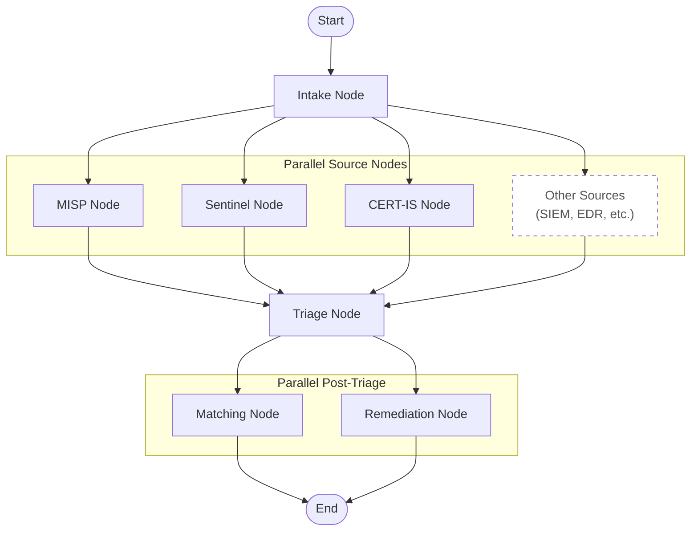
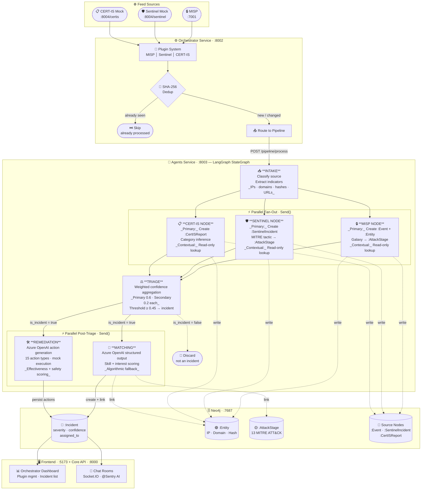
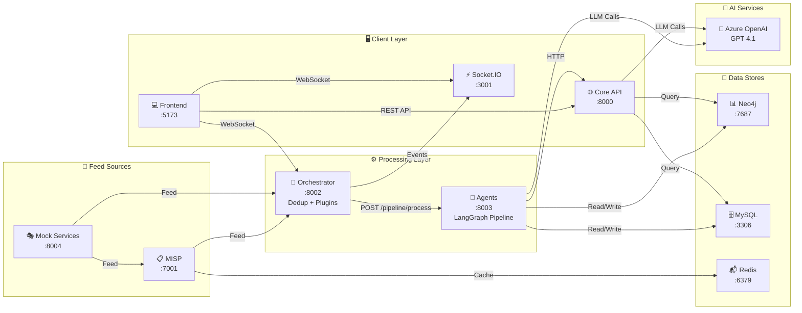
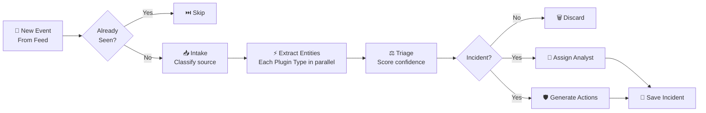

# System Architecture

> **NATO TIDE Hackathon 2026** — Canadian Army Team
> **Stack**: Python 3.11 / FastAPI / LangGraph / Neo4j / React / Azure OpenAI

---

## Table of Contents

1. [System Overview](#system-overview)
2. [Service Architecture](#service-architecture)
3. [LangGraph Pipeline](#langgraph-pipeline)
4. [Neo4j Graph Schema](#neo4j-graph-schema)
5. [Design Decisions](#design-decisions)
6. [Extending the System](#extending-the-system)
7. [Data Flow Example](#data-flow-example)
8. [Mermaid Diagrams](#mermaid-diagrams)

---

## System Overview

```
┌─────────────────────────────────────────────────────────────────────┐
│ Feed Sources                                                        │
│ ┌──────┐  ┌──────────────┐  ┌─────────────────┐                   │
│ │ MISP │  │ Mock Services │  │ Mock Services   │                   │
│ │:7001 │  │ :8004/sentinel│  │ :8004/certis    │                   │
│ └──┬───┘  └──────┬───────┘  └────────┬────────┘                   │
└────┼─────────────┼───────────────────┼──────────────────────────────┘
     │             │                   │
     ▼             ▼                   ▼
┌─────────────────────────────────────────────────────────────────────┐
│ Orchestrator Service :8002                                          │
│ Plugin system: enable/disable/create feeds via REST API             │
│ SHA-256 dedup: only new/changed events enter pipeline               │
│ SQLite state store: persists dedup hashes + activity log            │
└──────────────────────────┬──────────────────────────────────────────┘
                           │ POST /pipeline/process
                           ▼
┌─────────────────────────────────────────────────────────────────────┐
│ Agents Service :8003 — LangGraph StateGraph                         │
│                                                                     │
│ intake → [misp | sentinel | certis] (parallel) → triage            │
│       → [matching | remediation] (parallel) → END                  │
│                                                                     │
│ • 3 source nodes run CONCURRENTLY via Send()                       │
│ • Triage: weighted confidence aggregation                          │
│ • Matching: Azure OpenAI structured output + analyst assignment    │
│ • Remediation: Azure OpenAI action generation + mock execution     │
│ • All nodes read/write Neo4j                                       │
└──────────────────────────┬──────────────────────────────────────────┘
                           │
                           ▼
┌─────────────────────────────────────────────────────────────────────┐
│ Neo4j :7687                                                         │
│ Incidents, Entities, Events, SentinelIncidents, CertISReports,     │
│ AttackStages (13 MITRE ATT&CK), Users, Teams                      │
└──────────────────────────┬──────────────────────────────────────────┘
                           │
              ┌────────────┼────────────┐
              ▼            ▼            ▼
┌──────────────────┐ ┌──────────┐ ┌──────────────┐
│ Core API :8000   │ │ Frontend │ │ Socket :3001 │
│ Chat AI, DB      │ │ :5173    │ │ Real-time    │
│ routes, graph    │ │ React+MUI│ │ Socket.IO    │
│ proxy, MISP CRUD │ │          │ │              │
└──────────────────┘ └──────────┘ └──────────────┘
```

---

## Service Architecture

### Agents Service (Port 8003) — The Heart

**Technology**: Python FastAPI + LangGraph + Neo4j async driver + Azure OpenAI

This service owns the AI pipeline. It compiles a LangGraph `StateGraph` at startup and exposes it via `POST /pipeline/process`.

**Key files**:

- `graph.py` — StateGraph definition, `Send()` fan-out wiring, conditional edges
- `intake_node.py` — Source classification + indicator extraction
- `misp_node.py`, `sentinel_node.py`, `certis_node.py` — Source enrichment (dual-mode: primary vs contextual)
- `triage_node.py` — Weighted confidence aggregation (pure algorithmic, no LLM)
- `matching_node.py` — LLM analyst assignment with algorithmic fallback
- `remediation_node.py` — LLM remediation action generation with mock execution layer
- `neo4j_client.py` — Async Neo4j singleton driver
- `models.py` — Pydantic models for state + outputs

> **Note**: Analyst profiles are fetched from MySQL via the `DB_SERVICE_URL` (`/users` endpoint on core-api) at runtime — there is no static `analysts.json` file.

### Core API (Port 8000) — Unified API Gateway

**Technology**: Python FastAPI + Azure OpenAI SDK + httpx + aiomysql

This service consolidated the formerly separate `db-service` and `langgraph-service` stubs.

- **AI Chat**: `POST /chat` — `@Sentry` command triggers Azure OpenAI (gpt-4.1) with full Neo4j incident context. Supports commands: summarize, find similar, recommend remediation, change severity, close incident. Streams responses via SSE.
- **Graph proxy**: `GET /incidents/{id}/graph` — Proxies to agents-service
- **DB routes**: Incident + user CRUD via MySQL (upsert incidents, list/assign users)
- **Invoke stub**: `POST /invoke` — Legacy placeholder (returns `{"status": "pending"}`)

### Orchestrator Service (Port 8002) — Feed Management

**Technology**: Python FastAPI + SQLite

Plugin-based architecture with three built-in plugin types: `misp`, `sentinel`, `certis`. Each plugin:

1. Polls its feed source at configurable intervals
2. Deduplicates events using SHA-256 hash of attributes
3. Routes new/changed events to agents-service `POST /pipeline/process`
4. Logs activity for the frontend activity feed

**State persistence**: SQLite database (Docker volume mounted) stores processed event hashes, activity log entries, and plugin configurations.

### Mock Services (Port 8004) — Combined Feed Mocks

**Technology**: Python FastAPI

A single container that serves all three mock feed APIs:

- **Sentinel mock**: Generates fake security incidents every 3–8s with randomized titles, severities, MITRE tactics, and entities
- **CERT-IS mock**: Generates fake phishing/malware/advisory reports every 5–15s
- **MISP mock**: Serves mock MISP events with attributes and galaxies

All endpoints are prefixed: `/sentinel/...`, `/certis/...`, `/misp/...`

> **Note**: The legacy standalone `services/sentinel-mock/` and `services/cert-is-mock/` directories have been removed. The combined `services/mock-services/` container replaced them.

### Socket Service (Port 3001) — Real-time

**Technology**: Node.js + Socket.IO

Per-incident chat rooms with message history, typing indicators, participant tracking. Events: `join`, `message`, `typing`, `leave`.

### Frontend (Port 5173)

**Technology**: React 18 + TypeScript + Vite + MUI + Zustand + Socket.IO client

- **Orchestrator page**: Plugin management UI — create/enable/disable feeds, activity feed, incident list
- **Chat page**: Per-incident chat rooms with `@Sentry` AI assistant, markdown rendering
- **Auth**: Client-side only (Zustand + localStorage), mock users, no backend auth service

---

## LangGraph Pipeline

### Graph Topology



7 nodes registered: `intake`, `misp_node`, `sentinel_node`, `certis_node`, `triage_node`, `matching_node`, `remediation_node`. Fan-out uses LangGraph's `Send()` API for parallel execution at two stages: after intake (3 source nodes) and after triage (matching + remediation).

### Why Parallel Fan-Out?

Each source node is independent — MISP enrichment doesn't need Sentinel results, and vice versa. Running them in parallel:

1. **Reduces latency** — 3 Neo4j query batches run concurrently
2. **Enables cross-source correlation** — each node checks Neo4j for entities from OTHER sources
3. **Graceful degradation** — if one source node fails, the others still provide data for triage

### Dual-Mode Source Nodes

Each source node (MISP, Sentinel, CERT-IS) operates in two modes:

- **Primary** (this event IS from this source): Creates nodes in Neo4j, extracts full context
- **Contextual** (this event is from ANOTHER source): Read-only Neo4j lookup for cross-source matches

### Triage: Weighted Confidence

```
combined_confidence = (primary_weight × primary_confidence) +
                      Σ(secondary_weight × secondary_confidence)

Where:
  primary_weight = 0.6
  secondary_weight = 0.2 (each, redistributed if zero)
  threshold = 0.45 → is_incident
```

Triage is **pure algorithmic** — no LLM calls.

### Matching: LLM + Fallback

1. Map incident attributes to required skills (28+ category mappings, 14 MITRE tactic mappings)
2. Fetch analyst profiles from MySQL via `DB_SERVICE_URL`
3. Call Azure OpenAI (model from `OPENAI_MODEL` env, default `gpt-4.1`) with structured output (`AnalystSelection` Pydantic model)
4. If LLM fails → algorithmic fallback scoring analysts by skill overlap + interest + severity preference

### Remediation: LLM Action Generation + Mock Execution

Runs **in parallel with matching** after triage (second `Send()` fan-out).

1. Collects full incident context: indicators, affected entities, MITRE tactics, MISP/Sentinel/CERT-IS reasoning, Neo4j knowledge graph, linked MISP events
2. Calls Azure OpenAI (`gpt-4.1`) with structured output (`RemediationPlanLLM` Pydantic model) to produce 2–8 concrete actions
3. Each action targets a specific IOC (IP, domain, hash, hostname, etc.) with effectiveness and safety scores
4. Mock-executes each action via a dispatch table of 15 async executor functions (one per action type)
5. Persists remediation actions to MySQL for the frontend

**Action types** (15): `block_ip`, `block_domain`, `block_url`, `block_email_sender`, `add_firewall_rule`, `isolate_host`, `disable_account`, `revoke_sessions`, `quarantine_file`, `force_password_reset`, `enable_mfa`, `block_process`, `rate_limit_ip`, `null_route_ip`, `sinkhole_domain`

**Confidence scoring**: `confidence = 0.5 × effectiveness + 0.5 × safety` per action.

The execution layer is **mocked** — each executor logs what it would do and returns a synthetic result. Replace the mock body with real API calls (firewall, AD, EDR, etc.) to go live.

See [agent.md](agent.md) for detailed node contracts.

---

## Neo4j Graph Schema

### Node Types

| Label               | Key Properties                                                    | Created By                          |
| ------------------- | ----------------------------------------------------------------- | ----------------------------------- |
| `:Incident`         | id, title, severity, confidence, source_type, assigned_to, status | matching_node / remediation_node    |
| `:Event`            | source_event_id, title, threat_level, attributes                  | misp_node (primary)                 |
| `:Entity`           | value, type (IP/Domain/Hash/URL/Email)                            | all source nodes                    |
| `:SentinelIncident` | incident_id, title, severity, tactics                             | sentinel_node (primary)             |
| `:CertISReport`     | report_id, title, category, severity                              | certis_node (primary)               |
| `:AttackStage`      | name, order                                                       | neo4j-init.cypher (13 MITRE stages) |
| `:User`             | id, username, role                                                | neo4j-init.cypher                   |
| `:Team`             | id, name                                                          | neo4j-init.cypher                   |
| `:IncidentSnapshot` | workflow_step                                                     | pipeline audit trail                |

### Relationships

```cypher
// Source event → Entity links
(:Event)-[:INVOLVES_ENTITY]->(:Entity)
(:Event)-[:PART_OF_STAGE]->(:AttackStage)
(:SentinelIncident)-[:HAS_ENTITY]->(:Entity)
(:SentinelIncident)-[:AT_STAGE]->(:AttackStage)
(:CertISReport)-[:HAS_ENTITY]->(:Entity)
(:CertISReport)-[:AT_STAGE]->(:AttackStage)

// Incident links (copied from source events by matching_node)
(:Incident)-[:HAS_ENTITY]->(:Entity)
(:Incident)-[:AT_STAGE]->(:AttackStage)

// MITRE ATT&CK chain
(:AttackStage)-[:PRECEDES]->(:AttackStage)
// Reconnaissance → Resource Development → ... → Impact
```

> **Note**: The matching_node copies `:INVOLVES_ENTITY` edges from source events as `:HAS_ENTITY` on the Incident, and `:PART_OF_STAGE` edges as `:AT_STAGE` on the Incident. This means similarity queries on incidents use `:HAS_ENTITY` and `:AT_STAGE`.

### Indexes & Constraints

Unique constraints on `.id` for: `Incident`, `Entity`, `Event`, `User`, `Team`, `AttackStage`, `SentinelIncident`, `CertISReport`. Additional indexes on `Entity.type`, `Entity.value`, `Event.timestamp`, `AttackStage.order`, `IncidentSnapshot.workflow_step`, `SentinelIncident.severity`, `CertISReport.category`.

Schema initialized by: `helm/neo4j/files/neo4j-init.cypher`

### Useful Queries

```cypher
-- Cross-source correlation: entities in multiple source types
MATCH (e:Entity)<-[:INVOLVES_ENTITY|HAS_ENTITY]-(source)
WITH e, collect(DISTINCT labels(source)[0]) AS sources, count(source) AS hits
WHERE size(sources) > 1
RETURN e.value, e.type, sources, hits ORDER BY hits DESC

-- Incident with full context
MATCH (i:Incident {id: $id})
OPTIONAL MATCH (i)-[:HAS_ENTITY]->(e:Entity)
OPTIONAL MATCH (i)-[:AT_STAGE]->(s:AttackStage)
RETURN i, collect(DISTINCT e) AS entities, collect(DISTINCT s) AS stages

-- MITRE ATT&CK coverage
MATCH (s:AttackStage)
OPTIONAL MATCH (i:Incident)-[:AT_STAGE]->(s)
RETURN s.name, s.order, count(i) AS incidents ORDER BY s.order

-- Blast radius from indicator
MATCH (e:Entity {value: $indicator})<-[*1..2]-(connected)
RETURN e, connected
```

---

## Design Decisions

| Decision                              | Why                                                     | Trade-off                                      |
| ------------------------------------- | ------------------------------------------------------- | ---------------------------------------------- |
| **Parallel fan-out** (not sequential) | Cross-source correlation + lower latency                | More complex state aggregation in triage       |
| **Dual-mode source nodes**            | Every event gets checked against ALL sources            | Each node does both read and write to Neo4j    |
| **Azure OpenAI for matching**         | Considers growth opportunities, not just skills         | Cost per incident, requires API key            |
| **Algorithmic fallback**              | Pipeline works without Azure OpenAI                     | Less nuanced assignment                        |
| **Azure OpenAI for remediation**      | Context-aware per-incident action list                  | Cost per incident, requires API key            |
| **Mock execution layer**              | Demonstrates AI-driven response without live connectors | No real containment until connectors replaced  |
| **Parallel matching + remediation**   | Both complete in same wall-clock time as either alone   | Slightly higher concurrent OpenAI usage        |
| **SQLite for orchestrator state**     | Zero-config, survives restarts                          | Not distributed (single orchestrator instance) |
| **No backend auth**                   | Faster MVP development                                  | Not production-ready                           |
| **Socket.IO in Node.js**              | Best Socket.IO ecosystem                                | One non-Python service                         |
| **Combined mock-services**            | Single container for all mock feeds                     | Coupled mock lifecycle                         |
| **Core API absorbs db + langgraph**   | Fewer containers, simpler networking                    | Larger single service                          |
| **MySQL for incidents + users**       | Analyst profiles need relational queries                | Two databases (MySQL + Neo4j)                  |

---

## Extending the System

### Adding a New Feed Source

1. **Add mock endpoint** (optional): Add routes to `services/mock-services/main.py`
2. **Create orchestrator plugin**: `services/orchestrator-service/plugins/new_source_plugin.py` — extend `PluginBase`
3. **Create pipeline source node**: `services/agents-service/new_source_node.py` — dual-mode (primary + contextual)
4. **Wire into graph**: Add node to `graph.py`, add `Send()` in intake fan-out, add edge to triage
5. **Update intake_node**: Add source classification + indicator extraction logic
6. **Update Neo4j schema**: Add new node label + relationships in `neo4j-init.cypher`

### Adding a Chat Command

In `services/core-api/main.py`, add to the `@Sentry` command handler:

```python
if "your_command" in message.lower():
    # Query Neo4j or call agents-service
    # Stream response via SSE
```

---

## Data Flow Example

**Event**: Sentinel Mock generates a "Suspicious PowerShell Execution" alert with IP 10.0.0.5 and tactic "Execution"

1. **Orchestrator** polls `mock-services:8004/sentinel` → dedup check (new event) → `POST /pipeline/process`
2. **Intake** classifies as `sentinel` source, extracts indicators: `["10.0.0.5"]`
3. **Parallel fan-out**:
   - **Sentinel node** (PRIMARY): Creates `:SentinelIncident` in Neo4j, merges `(:Entity {value: "10.0.0.5"})`, maps "Execution" tactic to `:AttackStage`, queries for cross-source matches → confidence 0.7
   - **MISP node** (CONTEXTUAL): Searches Neo4j for MISP events involving 10.0.0.5 → finds WannaCry event → confidence 0.4
   - **CERT-IS node** (CONTEXTUAL): Searches Neo4j for CERT-IS reports involving 10.0.0.5 → no matches → confidence 0.0
4. **Triage**: Primary (sentinel) 0.7 × 0.6 = 0.42 + Secondary (misp) 0.4 × 0.4 = 0.16 (cert-is zero, redistributed) = **0.58 > 0.45** → is_incident = True, severity = "high"
5. **Matching** (parallel): Required skills: `["powershell_analysis", "execution_tactics"]`. Fetches analyst profiles from MySQL. Azure OpenAI selects analyst Sarah Chen (skills match + expressed interest in lateral movement). Creates `:Incident` in Neo4j linked to entities + stages.
6. **Remediation** (parallel with matching): Azure OpenAI analyses the incident context and recommends: block IP 10.0.0.5 (effectiveness 0.85, safety 0.9), isolate affected host (effectiveness 0.9, safety 0.6). Mock-executes each action and persists results to MySQL.

---

## Mermaid Diagrams

### Diagram 1: Full Incident Processing Flow



### Diagram 2: Service Interaction Flow



### Diagram 2: Incident Processing Pipeline



These are **Mermaid.js** diagrams rendered in GitHub markdown, VS Code, GitLab, Notion, and Confluence.
